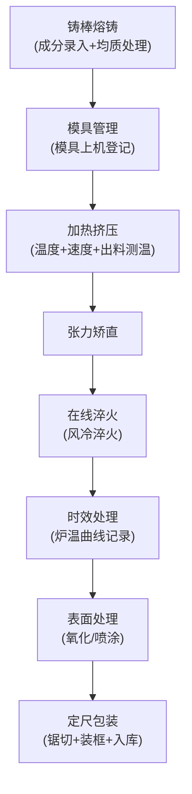

# 铝型材厂挤压车间业务管理系统 - 产品需求文档(PRD)

## 1. 产品概述

本系统为铝型材厂挤压车间量身定制的生产业务管理系统，通过数字化手段管理从铸棒熔铸到成品包装的全流程生产数据。系统涵盖铸棒熔铸、模具管理、加热挤压、在线淬火、时效处理、表面处理、定尺包装七大核心模块，帮助企业实现生产过程可追溯、工艺参数可管控、产品质量可保证的目标。

- **目标用户**：挤压车间生产管理人员、工艺工程师、一线操作人员、质量检验人员
- **核心价值**：打通铝型材生产各环节数据孤岛，标准化工艺参数记录，提升生产效率和产品质量追溯能力

## 2. 核心功能

### 2.1 用户角色

| 角色 | 注册方式 | 核心权限 |
|------|----------|----------|
| 系统管理员 | 后台创建 | 用户管理、系统配置、全模块数据访问 |
| 生产主管 | 后台创建 | 全模块数据查看、审核确认、报表统计 |
| 工艺工程师 | 后台创建 | 工艺参数配置、数据录入、质量分析 |
| 操作员 | 后台创建 | 本工序数据录入、进度查看 |
| 质检员 | 后台创建 | 质量数据录入、检验报告生成 |

### 2.2 功能模块

1. **Dashboard概览页**：生产进度看板、关键指标展示、今日生产统计、异常告警
2. **铸棒熔铸模块**：铝棒熔铸成分记录、铸棒均质处理、批次管理
3. **模具管理模块**：模具台账、模具上机记录、模具寿命追踪
4. **加热挤压模块**：铸棒加热温度、挤压速度记录、出料口测温、张力矫直
5. **在线淬火模块**：在线风冷淬火参数记录、淬火工艺曲线
6. **时效处理模块**：时效炉温曲线、时效工艺参数、批次追溯
7. **表面处理模块**：型材氧化喷涂、前处理记录、膜厚检测
8. **定尺包装模块**：定尺锯切记录、成品装框、入库管理

### 2.3 页面详情

| 页面名称 | 模块名称 | 功能描述 |
|----------|----------|----------|
| Dashboard | 生产概览 | 今日产量统计、设备状态、7个工序进度条、关键KPI卡片、实时温度监控 |
| 铸棒熔铸 | 熔铸管理 | 铝棒成分录入表格(Si/Fe/Cu/Mn/Mg/Cr/Zn/Ti)、均质处理记录、批次号生成、成分合格判定 |
| 模具管理 | 模具台账 | 模具编号、型号规格、设计图纸、上机次数、累计挤压吨数、状态(待用/上机/维修/报废) |
| 模具管理 | 上机记录 | 模具上机登记、机台号、上机时间、下机时间、挤压重量、磨损情况 |
| 加热挤压 | 挤压参数 | 铸棒加热温度(上/中/下)、挤压速度、出料温度、主缸压力、型材出料速度 |
| 加热挤压 | 张力矫直 | 矫直记录、拉伸率、直线度检测、矫前后对比 |
| 在线淬火 | 淬火参数 | 风冷温度、风速、淬火区段温度、冷却速率、淬火硬度检测 |
| 时效处理 | 炉温曲线 | 升温/保温/降温三段式温度曲线、实时温度记录折线图、炉号/批次/装炉量 |
| 表面处理 | 氧化喷涂 | 槽液参数、氧化时间、电压电流、膜厚测试、喷涂颜色/厚度/附着力 |
| 定尺包装 | 锯切装框 | 定尺长度、锯切数量、支数统计、成品等级、装框编号、入库确认 |

## 3. 核心流程

### 生产主流程描述

1. **铸棒准备**：操作员录入熔铸成分数据，系统自动判定成分是否达标，生成铸棒批次号，进行均质处理记录
2. **模具准备**：根据生产计划选择模具，进行上机登记，记录机台号和上机时间
3. **加热挤压**：记录铸棒加热三区温度，实时监控挤压速度和出料口温度，完成挤压后进行张力矫直
4. **在线淬火**：通过风冷系统对型材进行淬火处理，记录各区段温度和冷却参数
5. **时效处理**：型材装入时效炉，系统全程记录炉温曲线，支持查看和导出温度报表
6. **表面处理**：进行氧化或喷涂处理，记录槽液参数、处理时间和膜厚检测数据
7. **定尺包装**：按客户要求定尺锯切，统计支数和重量，分级装框，完成入库

## 4. 用户界面设计

### 4.1 设计风格

- **主色调**：工业蓝(#1E40AF)作为主色，体现工业制造业稳重专业的特性；橙红(#EA580C)为警示色用于异常数据提醒
- **辅助色**：深灰(#1F2937)背景、中灰(#4B5563)文字、浅灰(#F9FAFB)数据卡片背景
- **按钮风格**：矩形略带圆角(4px)，主按钮使用工业蓝填充白字，支持悬停加深效果
- **字体**：标题使用"Noto Sans SC"粗体，正文使用"Noto Sans SC"常规体；数字使用等宽字体"JetBrains Mono"提升数据可读性
- **布局风格**：左侧垂直导航栏(240px固定宽度) + 顶部状态面包屑 + 右侧内容区，采用卡片式布局展示各模块数据
- **图标风格**：使用工业风格线性图标，搭配工序专用符号(如熔炉、温度计、齿轮等)

### 4.2 页面设计概览

| 页面名称 | 模块名称 | UI元素 |
|----------|----------|--------|
| Dashboard | 生产概览 | 6张KPI卡片(今日产量/成品率/设备OEE/在制批次/异常数/能耗)、7工序进度横向流程图、实时温度监控面板、今日生产列表 |
| 铸棒熔铸 | 熔铸管理 | 成分录入表单(8个元素滑动条+输入框)、批次列表表格、均质处理温度时间线、合格/不合格状态标签 |
| 模具管理 | 模具台账 | 卡片式模具列表(显示状态色标)、筛选工具栏、上机次数进度条、详情抽屉面板 |
| 加热挤压 | 挤压参数 | 三区温度仪表盘(半圆仪表)、挤压速度实时曲线图、出料温度数字显示、矫直记录双栏对比 |
| 时效处理 | 炉温曲线 | 大尺寸折线图(时间轴+温度轴，升温红色/保温绿色/降温蓝色)、工艺参数信息卡、批次追溯表格 |
| 定尺包装 | 锯切装框 | 定尺长度选择器、数量统计卡片、等级分类标签、装框二维码预览、入库确认按钮 |

### 4.3 响应式设计

- **桌面优先**：主面向车间大屏和管理端桌面设备(1920×1080及以上)
- **平板适配**：车间平板端支持触摸操作，导航栏可折叠收起
- **数据优先**：核心数据展示区保证最小可读宽度，表格支持横向滚动
- **触控优化**：操作按钮最小高度44px，关键操作提供二次确认弹窗

### 4.4 特殊视觉效果

- **实时数据闪烁**：温度、速度等实时数据变化时，数字有轻微高亮过渡动画
- **炉温曲线渐变**：时效炉温曲线不同阶段使用不同颜色渐变填充区域
- **工序进度条**：主流程图当前工序高亮脉冲动画，已完成工序绿色，未开始灰色
- **状态指示灯**：设备状态使用圆形指示灯，绿色运行/黄色待机/红色报警，带呼吸灯效果
