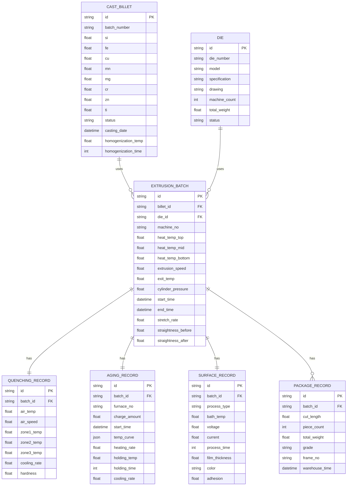

# 铝型材厂挤压车间业务管理系统 - 技术架构文档

## 1. 架构设计

```mermaid
graph TD
    A["前端应用层<br>(React 18 + Vite)"] --> B["路由层<br>(React Router)
    B --> C["UI组件层<br>(TailwindCSS 3 + 自定义组件)
    C --> D["状态管理层<br>(React Context + Hooks)
    D --> E["数据层<br>(Mock数据 + LocalStorage)
    E --> F["图表可视化<br>(Recharts)
```

## 2. 技术描述

- **前端框架**: React 18 (TypeScript)
- **构建工具**: Vite 5
- **样式方案**: TailwindCSS 3.4
- **路由管理**: React Router DOM 6
- **图表库**: Recharts 2
- **图标库**: Lucide React
- **数据持久化**: LocalStorage (生产数据持久化存储)
- **日期处理**: date-fns
- **字体方案**: Noto Sans SC + JetBrains Mono
- **后端方案**: 无后端，纯前端实现，数据使用Mock数据模拟

## 3. 路由定义

| 路由路径 | 页面组件 | 功能用途 |
|-----------|----------|----------|
| / | Dashboard | 生产概览看板首页 |
| /dashboard | Dashboard | 生产概览看板 |
| /casting | CastingModule | 铸棒熔铸模块 |
| /die | DieManagement | 模具管理模块 |
| /extrusion | ExtrusionModule | 加热挤压模块 |
| /quenching | QuenchingModule | 在线淬火模块 |
| /aging | AgingModule | 时效处理模块 |
| /surface | SurfaceTreatmentModule | 表面处理模块 |
| /packaging | PackagingModule | 定尺包装模块 |

## 4. 数据模型

### 4.1 ER图



## 5. 项目目录结构

```
src/
├── components/          # 通用组件
│   ├── Layout/       # 布局组件
│   │   ├── Sidebar.tsx
│   │   ├── Header.tsx
│   │   └── index.tsx
│   ├── Dashboard/    # Dashboard组件
│   ├── common/      # 通用UI组件
│   └── charts/    # 图表组件
├── pages/            # 页面模块
│   ├── Dashboard.tsx
│   ├── Casting.tsx
│   ├── DieManagement.tsx
│   ├── Extrusion.tsx
│   ├── Quenching.tsx
│   ├── Aging.tsx
│   ├── SurfaceTreatment.tsx
│   └── Packaging.tsx
├── data/             # Mock数据
│   ├── mockData.ts
│   └── types.ts
├── context/          # Context状态管理
│   └── ProductionContext.tsx
├── utils/            # 工具函数
│   └── helpers.ts
├── App.tsx
├── main.tsx
└── index.css
```

## 6. 核心状态管理

使用 React Context + useReducer 管理全局生产数据状态：

- 生产批次数据流：存储当前生产批次数据，包含7个工序状态流转
- UI状态：当前选中工序、弹窗状态
- 实时数据模拟：温度、速度等实时变化的模拟数据

## 7. 前端关键组件设计

### 7.1 炉温曲线图组件
- 使用Recharts实现的AreaChart展示时效炉温曲线
- 三段式分区渲染(升温/保温/降温)
- 支持鼠标悬浮显示具体数值
- 支持动态数据刷新动画

### 7.2 实时仪表盘组件
- 半圆式温度仪表盘
- 自定义SVG仪表盘
- 温度超限变色效果
- 实时刷新动画

### 7.3 工序进度组件
- 7工序进度条组件
- 当前工序脉冲高亮
- 状态色标系统

## 8. 数据初始化

系统启动时加载Mock初始数据：
- 10条铸棒批次数据
- 20套模具台账
- 5条在制生产批次
- 时效炉温曲线样本数据
